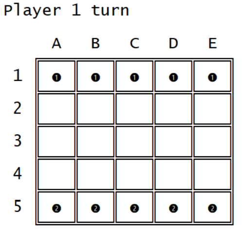
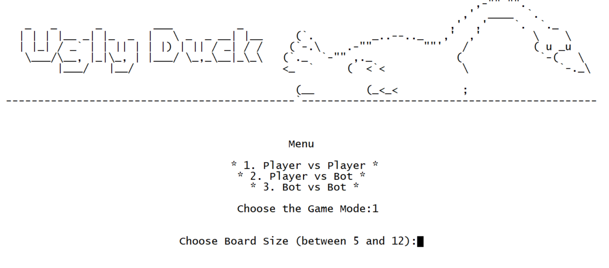
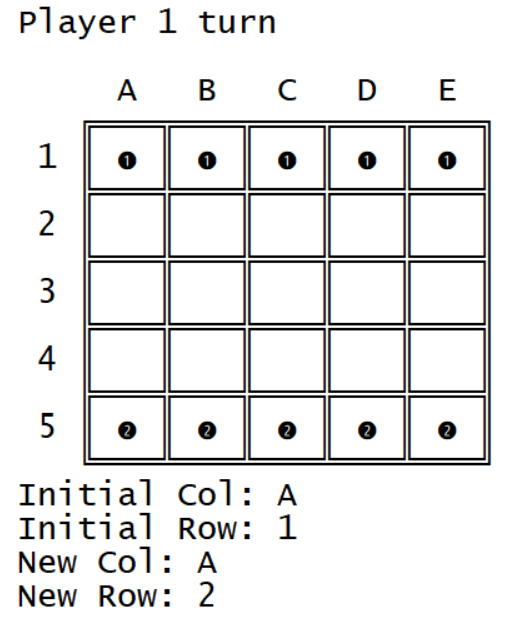
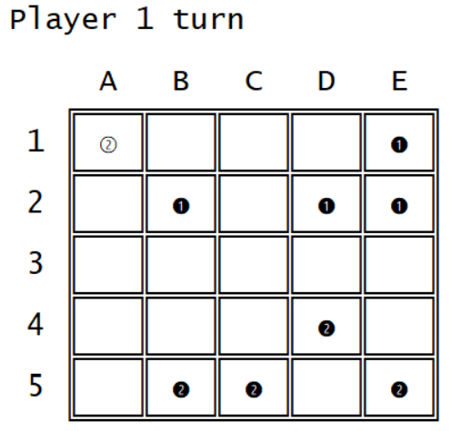
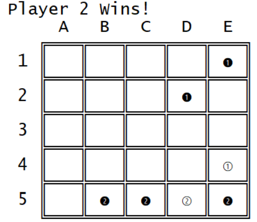

# Trabalho prático 2 - Ugly Duck

## Turma 2 Ugly Duck(T02_UglyDuck_1)

- Ana Beatriz Cruz Fontão, up202003574 - 50%
- Ana Rita Baptista de Oliveira, up202004155 - 50%

## Instalação e Execução

Instalar o SICStus Prolog e de seguida corrê-lo. Para evitar desformatação, é necessário ir a **Settings > font** e escolher a letra **Lucida Console** e o tamanho **20**.  
Para jogar o jogo, precisa de fazer consult do ficheiro game.pl e chamar a função play, que não leva nenhum argumento (**play.**).

---

## Descrição do Jogo

### Regras

- Cada jogador começa com um igual número de patos alinhados na primeira linha do tabuleiro
- Um pato pode mover-se uma célula na vertical ou nas diagonais para a frente
- Quando atinge a ponta oposta do tabuleiro, um pato transforma-se num cisne
- Os cisnes movem-se da mesma forma que os patos mas no sentido oposto
- Cisnes e patos podem capturar peças do adversário na diagonal. As capturas não são obrigatórias
- Ganha quem conseguir chegar com um cisne à base do tabuleiro primeiro ou quem capturar todas as peças do adversário

Pode verificar as regras do jogo em: https://www.di.fc.ul.pt/~jpn/gv/uglyduck.htm
 

Representação inicial do tabuleiro:

---

## Lógica do Jogo

### Representação interna do estado do jogo

O tamanho do tabuleiro é escolhido no menu pelo jogador. O estado do jogo é representado por uma matriz quadrada de tamanho igual ao tabuleiro. As células que contêm peças têm o nome das peças (ducko e swano são, respetivamente, o pato e cisne do jogador 1 e duckt e swant são, respetivamente, o pato e cisne do jogador 2). Células vazias têm o valor 'e'. 
Foi criado o predicado **start(+GameMode, +GameState, +PlayerTurn)** no ficheiro game.pl para acompanhar que jogador deve jogar (player1 ou player2), o modo de jogo e o estado do jogo. 
Este é chamado dentro do predicado **play()** após o menu.

---

### Visualização do estado de jogo

Inicialmente, como é possível observar na imagem abaixo, o utilizador irá ter acesso ao menu do jogo onde pode selecionar o tamnanho do tabuleiro e o modo de jogo.

Quando começa a jogar, o utilizador vê no topo do ecrã qual o jogador que deve realizar a jogada seguinte. 
Abaixo, vê o tabuleiro com o estado de jogo atual. Este contém as peças dos jogadores com a seguinte representação:
- patos do jogador 1: &#x278a;
- cisnes do jogador 1: &#x2780;
- patos do jogador 2: &#x278b;
- cisnes do jogador 2: &#x2781;
 

Finalmente, é pedido ao jogador respetivo a jogada que pretende realizar, pedindo a coluna e a linha inicial e a coluna e a linha final.

O estado inicial do tabuleiro é obtido com o predicado **initial_state(+Size, -GameState)** que, consoante o tamanho escolhido, cria um gamestate com as peças dos jogadores nas posições iniciais.

O estado intermédio do tabuleiro são todos os estados entre o inicial e o final incluindo movimento de peças e capturas.

O estado final do tabuleiro ocorre quando um cisne chega à base do jogador específico ou quando apenas existem pessoas de um dos jogadores.

---

### Execução de Jogadas

Para o movimento das peças foi criado o predicado **move(+GameState, +Move, -NewGameState)** que faz a alteração do estado do jogo (GameState) de acordo ao Move recebido. O movimento recebido encontra-se no formato de lista: [Coluna Original, Linha Original, Coluna Final, Linha Final]. Este predicado altera a matriz trocando a célula original para a célula final e colocando na célula original o valor **e**. 

Este movimento é sempre válido, já que foi avaliado pelos predicados auxiliares **is_move_valid(+GameState, +PlayerTurn, +Piece, +Move, -Valid)** e **valid_moves(+GameState, +Player, -ListOfMoves)** anteriormente. 

---

### Lista de Jogadas Válidas

O predicado **valid_moves(+GameState, +Player, -ListOfMoves)** gera uma lista de movimentos válidos para o dado jogador. 

Foram utilizados três predicados auxiliares (get_first_option, get_second_option e get_third_option), que para uma dada peça, verificam se é possível o movimento na vertical, na diagonal para a esquerda e na diagonal para a direita, respetivamente. Case este movimento seja válido, é retornado numa lista. No predicado **get_valid_moves(+Piece, +Col, +Row, +Length, -Moves)**, as três listas são concatenadas formando todos os movimentos válidos para a dada peça.  

Estes podem gerar capturas, também válidas (**valid_capture(+GameState, +Move, +Piece)**). Neste predicado, verificamos se, num dado movimento, é realizada uma captura ilegal, ou seja, na vertical ou a uma peça da mesma equipa. 

Este processo é repetido para todas as peças do jogador de forma a obter todos os movimentos válidos possíveis na ronda.

---

### Final do Jogo

Para a verificação de final do jogo, foi criado o predicado **game_over(-GameState, +Winner)** que verifica se existem cisnes do jogador 1 na primeira linha ou cisnes do jogador 2 na última linha e, caso não existam, verifica se ambos os jogadores ainda têm peças.
Caso algum dos jogadores tenha ganho, Winner passará a ser player1 ou player2 dependendo de qual ganhou. Caso nenhum tenha ganho, Winner será **e** de vazio.

Para auxílio ao predicado principal, foram criados dois predicados auxiliares: **check_game_over(+Size, +BoardSize, +Row, +RowNum, -Winner)**, que, de acordo com o número da linha **RowNum** verifica se existem cisnes do jogador respetivo na primeira ou última linha, e **is_still_playing(+GameState, +Player)**, que verifica se o player especificado, player1 ou player2, ainda tem peças.

---

### Avaliação do Tabuleiro

Para avaliar o valor total que um jogador possui no tabuleiro foi usado o predicado **value(+GameState, +Player, -Value)**. Aqui é calculada a soma dos valores das peças do jogador presentes em jogos. Escolhemos os seguintes valore para as peças: cisnes valem 50 pontos e patos valem 10 pontos.

---

### Jogada do Computador

Para a jogada do computador foi desenvolvido o predicado **choose_move(+GameState, +Player, +Level, -Move)**, que, dependendo do nível, escolhe os movimentos para computador random (nível 1) ou para o computador greedy (nível 2).

No nível 1, é necessário primeiro calcular todos os movimentos possíveis para o jogador. Após isto, simplesmente usasse **random(+L, +U, -R)** para escolher aleatoriamente o número do movimento na lista de movimentos válidos. Esse movimento é o escolhido para ser jogado.A

No nível 2, após obtermos os movimentos válidos para o jogador, estes são avaliados para chegar ao mais vantajoso. Para isso, é aplicado, temporariamente, cada movimento ao estado de jogo atual e com, o auxílio do predicado value referido anteriormente, verificamos qual a vantagem do jogador. É depois selecionado o movimento que dá maior vantagem ao jogador.

---

### Conclusões

O objetivo deste trabalho é implementar um jogo de tabuleiro na linguagem SICStus Prolog. O jogo necessitava de ter modos de jogo diferentes, nomeadamente, Pessoa vs Pessoa, Pessoa vs Computador e Computador vs Computador. Para o computador era necessário implemetar dois níveis de dificuladade, um aleatório e um greedy.  
No geral, pensamos que o trabalho foi concluído com sucesso, já que atingimos todos objetivos acima referidos.

Quanto a problemas conhecidos, quando verificamos se o jogo acabou, não averiguamos se os jogadores têm movimentos possíveis, ou seja, é continuamente perguntado a um jogador que deveria perder qual movimento quer realizar, em vez de apenas acabar o jogo. Este caso é muito raro, pelo que não pensamos inicialmente nessa possibilidade. Outro problema ocorre quando alguns inputs são inválidos, dando origem a prints indesejados.

Possíveis melhorias seriam:
- No algoritmo greedy poderiamos adicionar a verificação de vitória para cada movimento. Ou seja, se um movimento leva o computador a ganhar o jogo, este deve ser mais valorizado que os outros, independentemente da vantagem ou desvantagem que apresenta.
-  Implementar botões para voltar para trás no menu. No menu, não existe forma de voltar atrás, implicando que se nos enganarmos ou quisermos escolher outra opção, temos obrigatoriamente de fechar o menu e correr novamente o programa.
- O input da jogada é fragmentado em 4 opções (Coluna inicial, Linha Inicial, Coluna Final e Linha Final). Seria mais desejável se o input fosse apenas a Célula Inicial e a Célula Final, no formato **A1**.

---

### Bibliografia

Usamos os seguintes recursos:
- https://sicstus.sics.se/sicstus/docs/latest4/html/sicstus.html/ (Documentação de SICStus Prolog)
- Slides disponibilizados no moodle